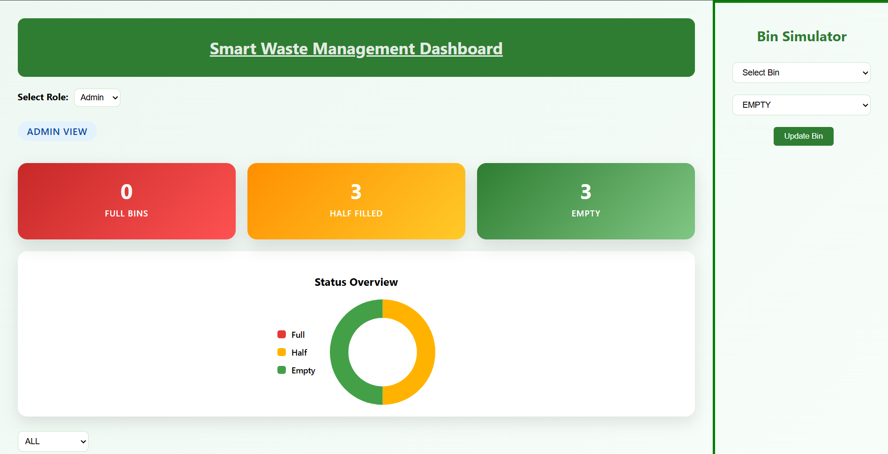
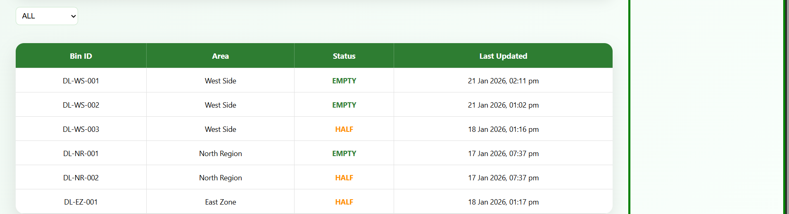
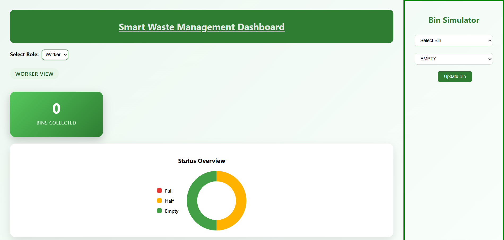
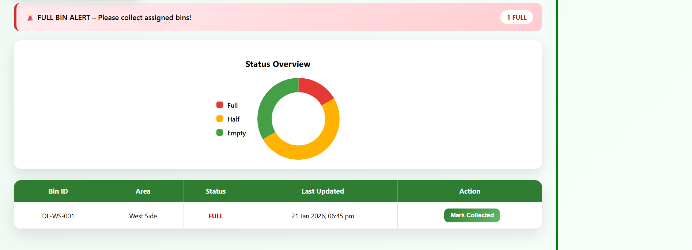
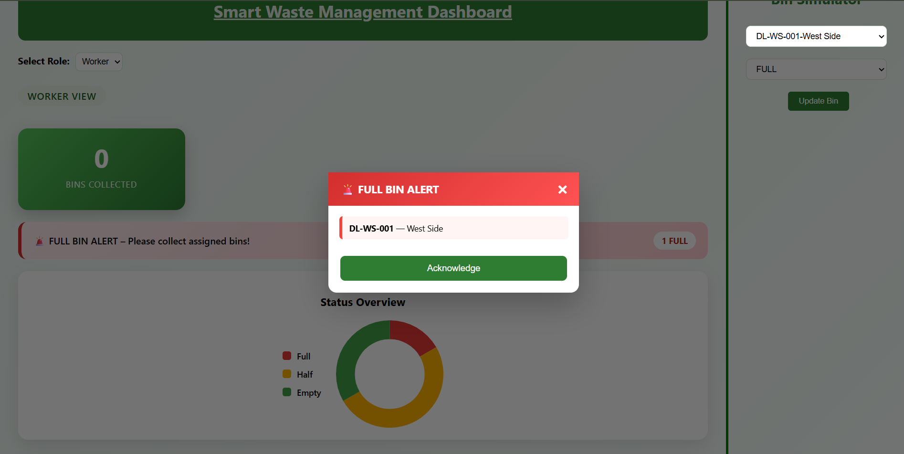

# Smart Waste Management System

A full-stack waste Management System

-**Frontend: **React.js
-**Backend: **Flask(Python)
-**Database: **MySQL
-**Charts: **Chart.js


## Features
-Admin & Worker roles
-Live bin status tracking
-Full bin alerts
-Collection tracking(prototype)
-Interactive dashboard & charts


### Screenshots
### Admin Dashboard
 
 

### Woker View 



### Alert



## How to run 

### frontend
cd frontend\waste-dashboard
npm install
npm start


### Backend
```bash
cd backend
pip install -r requirements.txt
python app.py


